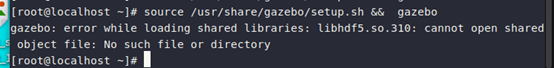

#   Gazebo使用问题
##  gazebo安装环境
    
### 1·安装openEuler:

完全参照 https://openeuler-ros-docs.readthedocs.io/en/latest/installation/vm-install-oe.html# 

虚拟机安装X86的openeuler 24.03系统，执行最小安装： 

宿主机配置： 

    Win11 
    VMware创建的虚拟机
    AMD核显
    16G运存

虚拟机分配：

    8G运存 
    40G存储
### 2·gazebo源设置与安装: 
Gazebo安装参考如下图：  
      
#### 安装过程：
1·在/etc/yum.repos.d建立gazebo.repo文件 
    
2·在gazebo.repo中设置源如下：
```
[ROS-SlG-Multi-Version-ros]   
name=ROS-SlG-Multi-Version-ros-humble-openEuler-24.03-LTS-ROS-3rdparty   
baseurl=https://eulermaker.compass-ci.openeuler.openatom.cn/api/ems1/repositories/ROS-SIG-Multi-Version_ros-humble_openEuler-24.03-LTS-ROS-3rdparty/openEuler%3A24.03-LTS/$basearch    
gpgcheck=0    
enabled=1
```  
3·打开终端输入```yum update && yum install gazebo*``` 来安装   
### 3·安装后：
1·输入source /usr/share/gazebo/setup.bash && gazebo后显示没找到libhdf5.so.310    
    
2·然后查到是因为没有添加路径在环境变量中，用命令行找到libhdf5.so.310   
   
3·之后在.bashrc文件加入
`export LD_LIBRARY_PATH=$LD_LIBRARY_PATH:/usr/lib64/mpich/lib`     
  
4·`source ./bashrc`后再`source /usr/share/gazebo/setup.bash &&  gazebo`
直接跳转到开机密码输入，然后进去后会较长时间的黑屏再显示主页面，且打开的所有应用都关了。    
5·尝试过的解决方法：   
一、   
  
  
二、   
  
    
三、   
  
  
四、  
  
  
五、  
  

上述方法在终端输入后再执行gazebo 均不能解决问题。   
### 猜想原因：   
可能是GPU的问题，当前使用的是AMD 的核显。在与本文件的同路径下有问题演示的视频。

